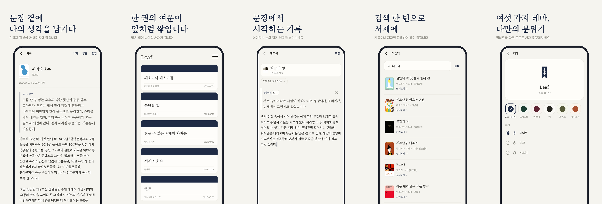

# 🌿 Leaf

> 책을 읽다 마음에 남은 문장을, 나뭇잎처럼 한 장씩 모아두는 독서 기록 앱

Leaf는 읽고 있는 책을 검색해 등록하고 독서 노트를 만드는 안드로이드 앱입니다.
100% Kotlin · Jetpack Compose 로 작성된 멀티 모듈 프로젝트입니다.


## 앱 소개
                                                                                           

## 모듈 구조
```
Leaf
├── app                      # Application, DI 그래프 루트, Firebase
├── build-logic/convention   # Gradle 컨벤션 플러그인
├── config                   # Detekt 설정, 커스텀 라이선스 고지
├── core
│   ├── common               # 도메인 모델 · EventBus · 시간 유틸 (순수 JVM)
│   ├── designsystem         # LeafTheme · 팔레트 · Leaf* 컴포넌트 · Modifier
│   ├── ui                   # MVIViewModel · Navigator · 페이징 · 애니메이션
│   ├── data                 # Repository (Note · Book · Setting)
│   ├── data-local           # Room · DataStore · 이미지 캐시
│   └── data-remote          # Ktor · DTO · 응답 매퍼
└── feature
    ├── main                 # MainActivity · MainNavHost · 테마 적용
    ├── intro                # 스플래시 / 최초 진입
    ├── home                 # 기록 목록
    ├── write                # 책 검색(search) + 블록 에디터(editor)
    ├── note-detail          # 기록 상세 · 이미지 공유
    ├── setting              # 설정 홈
    ├── setting-theme        # 테마 · 팔레트
    ├── setting-license      # 오픈소스 라이선스 목록/상세
    └── image-viewer         # 줌 가능한 이미지 뷰어
```